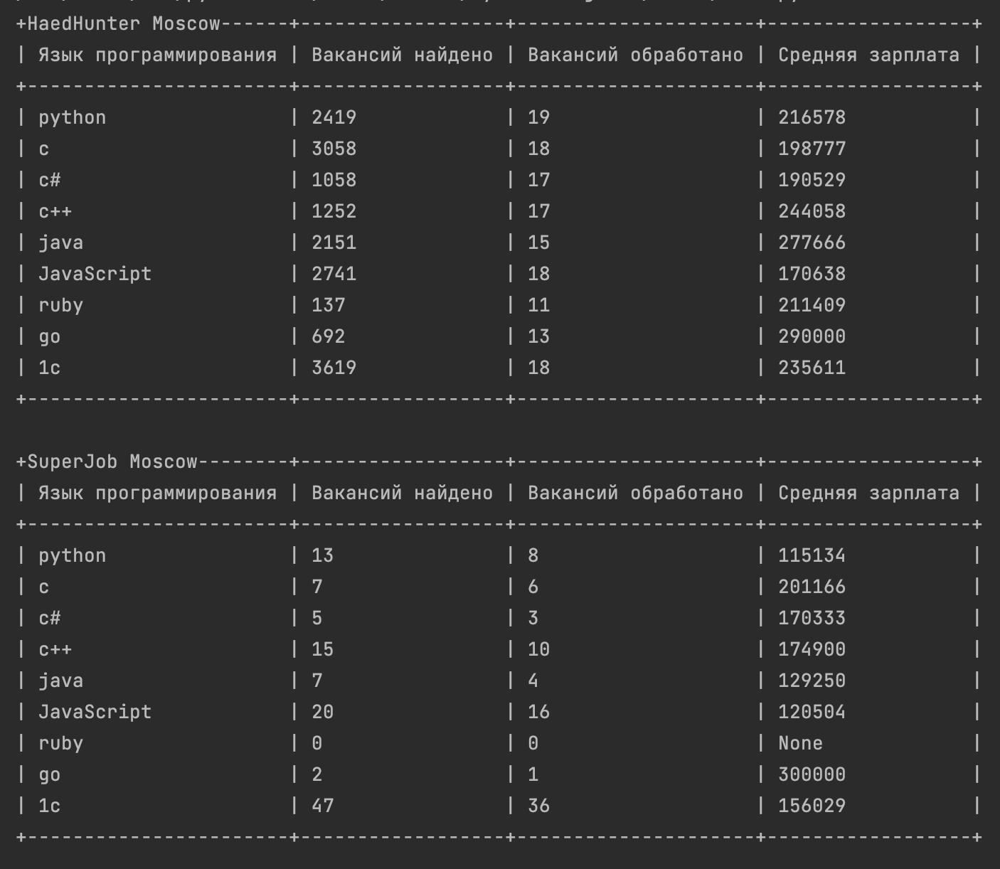

# Статистика по зарплатам программистов
Программа запрашивает информацию о вакансиях с сайтов [hh.ru](https://hh.ru) и [SuperJob](https://www.superjob.ru),
загружает данные по зарплатам для самых популярных языков программирования и отображает полученные данные в виде консольной таблицы
## Для использования необходимо
* установить python3
* установить необходимые зависимости (используя pip или pip3):
```bash
pip3 install -r requirements.txt
```
* для использования сервиса superjob необходимо получить API-key. Подробнее можно ознакомиться по [ссылке](https://api.superjob.ru/). Полученный ключ добавляется в файл .env в каталоге с программой:
```bash
SJ_KEY="<API_KEY>""
```
* После этого можно выполнять сам скрипт непосредственно:
```bash
python3 main.py
```
# Результаты
В результате выполнения скрипта, мы получим в консоли сводную таблицу с данными по вакансиям, содержащим данные об окладе. Выглядит это подобным образом:

